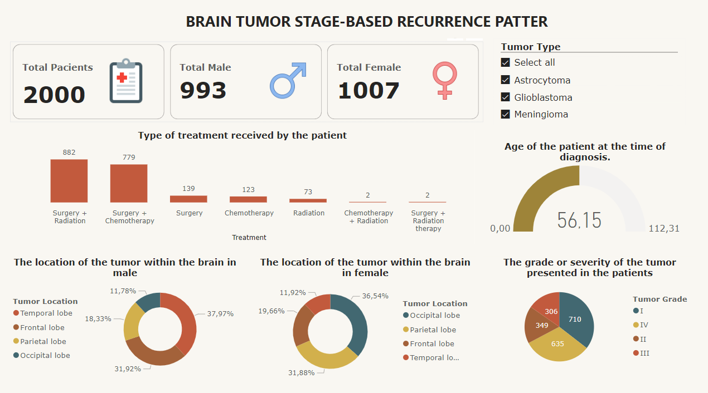

Los tumores cerebrales son neoplasias complejas y variadas que presentan desafíos significativos en su manejo clínico. Este estudio emplea un análisis por etapas y una investigación de patrones de recurrencia para comprender mejor la evolución de estos tumores. Al examinar la dinámica temporal del crecimiento y recurrencia tumoral, se busca descubrir los mecanismos subyacentes de la progresión de la enfermedad y posibles objetivos terapéuticos. Los hallazgos proporcionan valiosas implicaciones para tratamientos personalizados y una comprensión más profunda de los procesos moleculares y celulares que impulsan la progresión tumoral. A pesar de los avances diagnósticos y terapéuticos, los resultados del tratamiento siguen siendo insuficientes, destacando la necesidad de nuevas estrategias.

Este dashboard proporciona una herramienta interactiva y visualmente atractiva para explorar la compleja naturaleza de los tumores cerebrales, facilitando una mejor comprensión y apoyo en la toma de decisiones clínicas y de investigación. Gracias por su atención y espero que este dashboard sea una valiosa adición a sus recursos.

